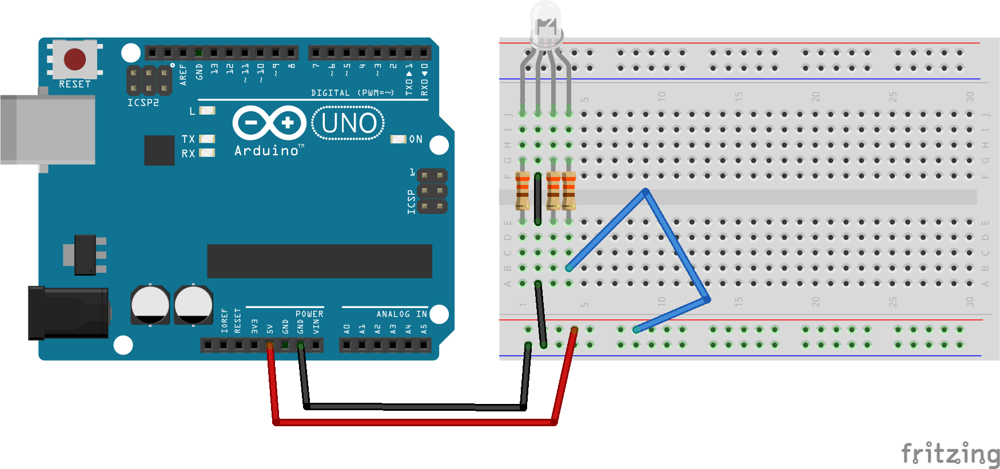
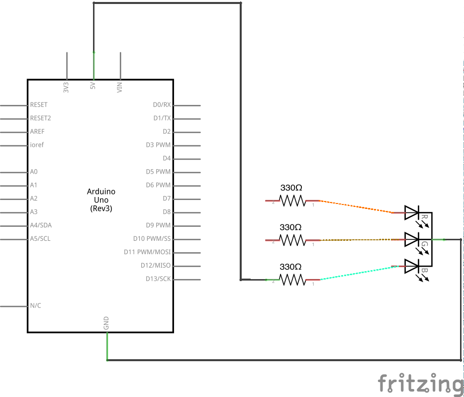
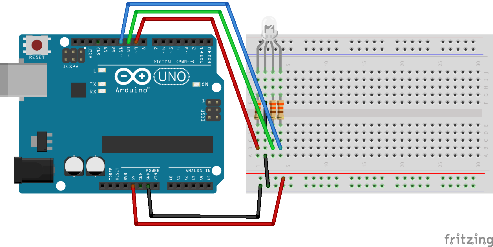
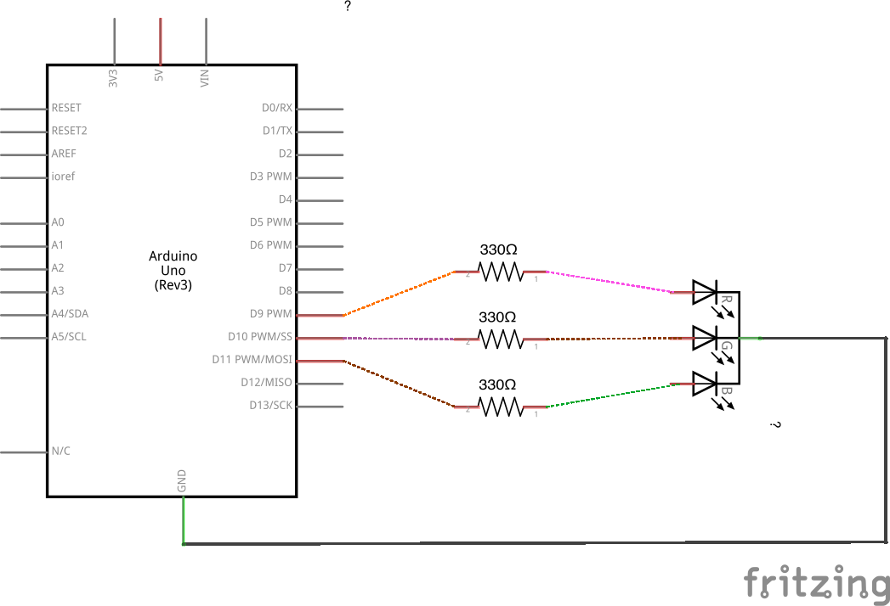

# Exploring Color

An RGB LED works like a computer screen, it relies on how your eye detects color.

Your eye has three types of color-sensitive cells (called *cones*). Each type is most sensitive to a particular color of light: red light, green light, and blue light. We perceive different relative proportions of those colors as different colors. For example, yellow light triggers the red- and green-sensitive cells in roughly equal amounts, and we perceive yellow light. That fact allows us to fake "yellow" by producing red and green in equal amounts.

An RGB LED, then, approximately lets us produce any color we want by varying the red, green, and blue channels individually. Let’s explore that.

1.  Start with the following circuit. Make sure to orient the LED correctly -- the flat side should be on the left as in the diagram below.

     

2.  The LED should appear blue. The the end of the wire connected to the LED's resistor and move it between the red, green, and blue positions. Observe the LED's colors.

3.  Connect the red, green, and blue legs of the LED to pins 9, 10, and 11:

     

4.  Write code to get these colors in this sequence: red, green, blue, red+green (yellow?), green+blue (cyan?), blue+red (magenta?), red+green+blue (white?).

        int redPin = 9;
        int greenPin = 10;
        int bluePin = 11;

        void setup() {
          pinMode(redPin, OUTPUT);
          pinMode(greenPin, OUTPUT);
          pinMode(bluePin, OUTPUT);
        }

        void clear() {
          digitalWrite(redPin, LOW);
          digitalWrite(greenPin, LOW);
          digitalWrite(bluePin, LOW);
        }

        void loop() {
          digitalWrite(redPin, HIGH);
          delay(1000);
          clear();

          digitalWrite(greenPin, HIGH);
          delay(1000);
          clear();

          digitalWrite(bluePin, HIGH);
          delay(1000);
          clear();
    
          digitalWrite(redPin, HIGH);
          digitalWrite(greenPin, HIGH);
          delay(1000);
          clear();
    
          digitalWrite(greenPin, HIGH);
          digitalWrite(bluePin, HIGH);
          delay(1000);
          clear();
    
          digitalWrite(bluePin, HIGH);
          digitalWrite(redPin, HIGH);
          delay(1000);
          clear();
    
          digitalWrite(redPin, HIGH);
          digitalWrite(greenPin, HIGH);
          digitalWrite(bluePin, HIGH);
          delay(1000);
          clear();
        }

* Observe that the mixed colors are not accurate -- the proportions are pretty far off! How can we correct this?
* We can adjust brightness of an LED (and an LED channel) using "analogWrite" -- it's not really analog in the true sense, it just blinks quickly in a pattern called PWM. [Note on PWM.]
* Let's use a potentiometer to control the brightness of channel to aid us in improving color fidelity. Connect your two potentiometers to analog pins A0 and A1. Borrow a third and connect it to analog pin A2.
* Use analogRead on pins A0, A1, and A3, respectively, to set the value for analogWrite on redPin, greenPin, and bluePin.
* Turn the LED off by turning all pots to 0.
* Experiment by turning the red and green pots to get a convincing orange color. (Likely to be full red and a little green.)
* Adjust the pots to get as close to white as you can.
* Use Serial.println to inspect the analogWrite values for red, green, and blue that produce white. We'll set these values as the maximum value for each channel.
* Write a setAdjustedColor function that uses map to convert the 0..1023 range of each analogInput to the 0..max for each channel.
* Use setAdjustedColor to set the LED's color based on the three pot values. Verify that the LED is white when the three pots are all the way on.
* Setting the red, green, and blue components is common, but not always the most useful way to think about color. Sometimes you want to pick a hue and keep it as bright and saturated as possible. That's what the Hue-Saturation-Brightness (HSB) color representation does.
* Use setHSBColor (provided) to control the hue, saturation, and brightness of the LED using the three potentiometers connected to pins A0, A1, A2.

Challenges:
* Use random() or another algorithm to slowly cycle through colors.
* Connect a button to a digital input pin. 
  * Modify the code so that the color of the LED doesn't change when the pots are rotated, but only when the button is pressed.
  * Instead of changing the color with the pots, increase the hue whenever the button is pressed, keeping full brightness and saturation. 
  * Instead of using a button, try the capsense library and a piece of copper foil. (You might use this in a lamp that changes color by touch.)
