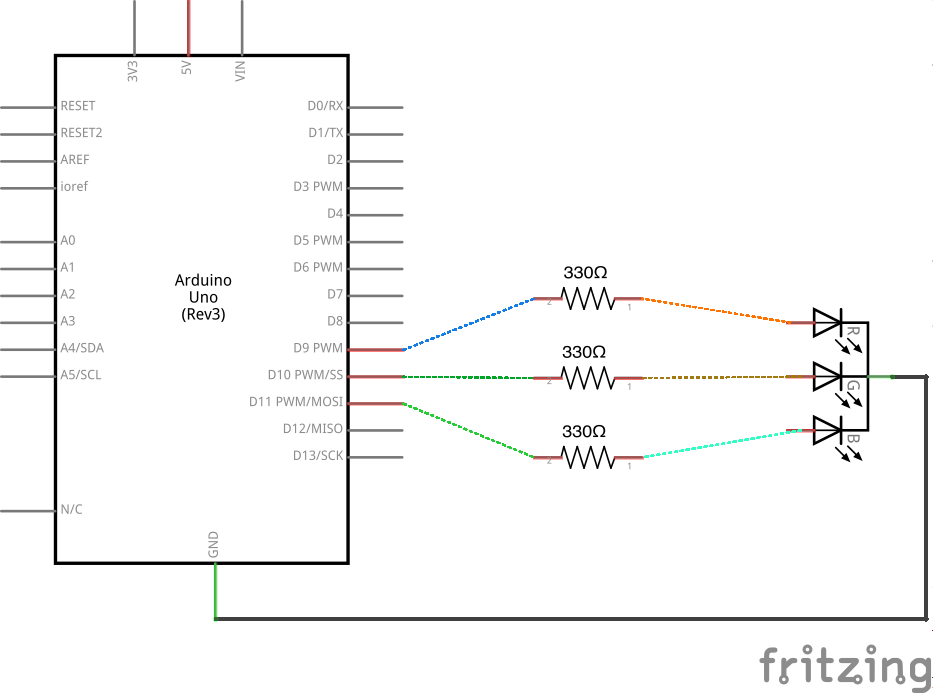

# Exploring Color

An RGB LED works like a computer screen; it relies on how your eye detects color. Your eye has three types of color-sensitive cells (called *cones*). Each type is most sensitive to a particular color of light: red light, green light, and blue light. We perceive different relative proportions of those colors as different colors. For example, yellow light triggers the red- and green-sensitive cells in a certain proportion, and we perceive yellow light. That fact allows us to fake "yellow" by producing red and green in that same proportion. In this lab, we'll play with colors and explore this effect.

An RGB LED, then, approximately lets us produce any color we want by varying the red, green, and blue channels individually. Let’s explore that.

1.  Start with the following circuit. Make sure to orient the LED correctly -- the flat side should be on the left as in the diagram below.

     

2.  The LED should appear blue. The the end of the wire connected to the LED's resistor and move it between the red, green, and blue positions. Observe the LED's color change.

3.  Connect the red, green, and blue legs of the LED to pins 9, 10, and 11:

     

4.  Write code to get these colors in this sequence: red, green, blue, red *and* green (should make yellow), green *and* blue (should make cyan), blue *and* red (should make magenta), and finally red, green, *and* blue (should make white).
    <%= sequence.ino =%>
5.  Notice that the mixed colors are not very accurate -- in fact, the proportions are pretty far off! How can you correct this?

6.  You can adjust brightness of an LED (and an LED channel) using `analogWrite` instead of `digitalWrite`. `analogWrite` blinks very quickly (faster than you can perceive) and can adjust brightness by sending specially timed pulses. This type of pulse pattern is called Pulse Width Modulation (PWM); only the pins marked with `~` support PWM.

    Modify the sequence code to reduce the brightness of the blue channel wherever it is used. You may find the [reference for the `analogWrite` function](http://arduino.cc/en/Reference/AnalogWrite) helpful, especially the example code.

7.  Uploading new code to see a new color is tedious. Insteas, use a potentiometer to control the brightness of each color. Connect your two potentiometers to analog pins `A0` and `A1`. Borrow a third potentiometer and connect it to analog pin `A2`:

     

8.  Use analogRead on pins `A0`, `A1`, and `A2`, respectively, to set the value for analogWrite on redPin, greenPin, and bluePin. Note that `analogRead` returns a number between `0` and `1023`, while `analogWrite` requires a number between `0` and `255`. To adapt the read value to be written, we can simply divide by `4`. In case you get stuck, here's the code:
    <%= analogRead_to_analogWrite.ino =%>
9.  Turn all the potentiometers to 0. You should observe the LED off.

10. Modify your code to use [the `map` function](http://arduino.cc/en/Reference/map), instead of dividing by 4.

11. Experiment by turning the red and green potentiometers to get a convincing orange color. (Likely to be full red and a little green.) Can you get teal? Purple? What about Gray?

12. Adjust all three potentiometers to get as close to white as you can.

12. Use `Serial.println` to send the values used in `analogWrite` to the serial monitor. (The code above does this for you.) Open the serial monitor and note which values for red, green, and blue produce the most compelling white color. You'll use these values to set the maximum end of the range for each of red, green, and blue.

13. Write a function called `setAdjustedColor` that uses map to convert the range of each channel (0 - 255) to the range for analog output for each channel (0 - max for that channel). Here's a snippet to get you started:

        //codeExt=ino
        // redValue, greenValue, and blueValue range from 0 to 255.
        void setAdjustedColor(int redValue, int greenValue, int blueValue) {
          // convert values with map
          // write values with analogWrite
        }

14. Use your new `setAdjustedColor` function to set the LED's color based on the three analog input values. Verify that the LED is white when the three potentiometers are rotated fully to the right. Your code might look something like this:
    <%= adjusted_color.ino =%>
15. Setting the red, green, and blue components is common, but not always the most useful way to think about color. For example, you may want a bright, saturdated color, but let someone modify the hue. That's what the Hue Saturation Brightness (HSB) color representation does. Instead of specifying red, green, and blue components of a color, you can specify a hue, a saturation, and a brightness.

    Converting from HSB to RGB is tricky, but here's a function that uses the `setAdjustedColor` function you wrote to set colors in HSB. Use it to make the analog inputs `A0`, `A1`, and `A2` control the hue, saturation, and brightness:
    <%= set_color_hsb.ino =%>

## Challenges:
1.  Use `random()` or another algorithm to slowly cycle through colors.
2.  Connect a button to a digital input pin.
    - Instead of changing the color with the potentiometers, increase the hue whenever the button is pressed, keeping full brightness and saturation. 
    - Modify the code so that the color of the LED doesn't change when the potentiometers are rotated, but only when the button is pressed.
    - Instead of using a button, try using the [CapSense library](http://playground.arduino.cc/Main/CapacitiveSensor) and a piece of copper foil. (For example, you could use this in a lamp that changes color by touch.)
